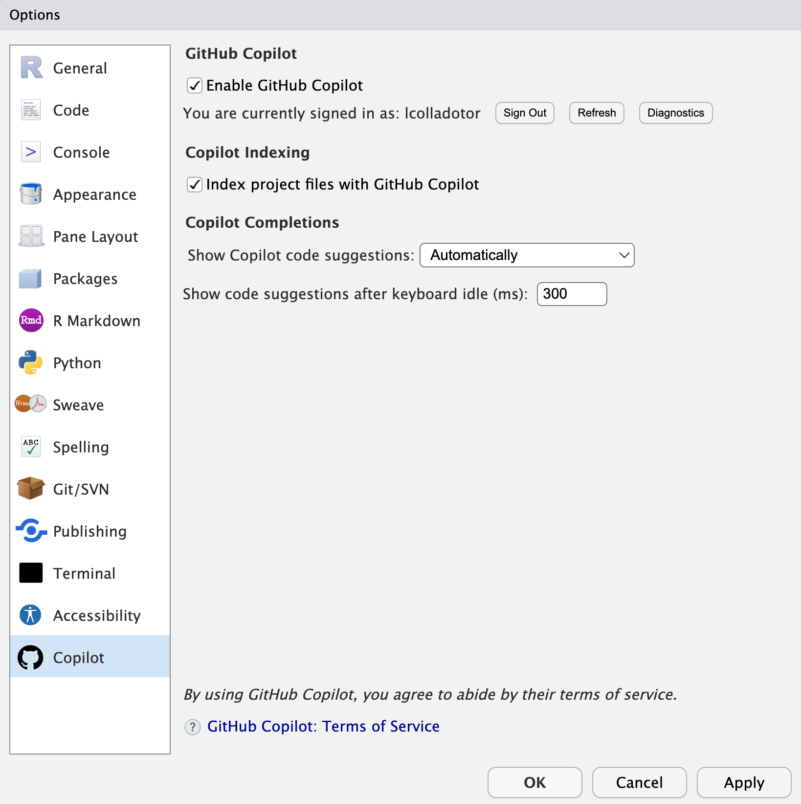

# Introducción a R y RStudio

## R

-   R: es gratis, de acceso libre, utilizado para muchos campos de trabajo, fuerte en la bioinformática a través de Bioconductor
-   Instalación a través de CRAN: <https://cran.r-project.org/>
-   Para explorar que se puede hacer con R:
    -   R Weekly <https://rweekly.org/>
    -   R Bloggers <https://www.r-bloggers.com/>
    -   Bluesky <https://bsky.app/search?q=%23rstats>
    -   Bluesky en español <https://bsky.app/search?q=%23rstatsES>
    -   TidyTuesday <https://bsky.app/search?q=%23TidyTuesday>
-   Para pedir ayuda hay muchas opciones
    -   <https://lcolladotor.github.io/bioc_team_ds/how-to-ask-for-help.html>
-   Material en el que estoy involucrado:
    -   <https://bsky.app/profile/lcolladotor.bsky.social> (principal medio actualmente)
    -   <https://twitter.com/lcolladotor> (originalmente)
    -   <https://www.youtube.com/@lcolladotor>
    -   LIBD rstats club <https://docs.google.com/spreadsheets/d/1is8dZSd0FZ9Qi1Zvq1uRhm-P1McnJRd_zxdAfCRoMfA/edit?usp=sharing>
    -   <https://bsky.app/profile/cdsbmexico.bsky.social> y <https://bsky.app/profile/libdrstats.bsky.social>


## GitHub

-   Permite compartir código
-   Se complementa con Git que es para tener un control de versiones de tu código
    -   <https://github.com/ComunidadBioInfo/cdsb2020/blob/master/presentaciones_flujos-de-trabajo/Introduccion-al-flujo-de-trabajo-orientado-a-proyectos.pdf>
-   Puedes tener páginas web estáticas
    -   <https://pages.github.com/>
    -   <https://github.com/lcolladotor/rnaseq_LCG-UNAM_2025>. En especial <https://github.com/lcolladotor/rnaseq_LCG-UNAM_2025/tree/gh-pages> se convierte en <http://lcolladotor.github.io/rnaseq_LCG-UNAM_2025/>
    -   Página personal: <https://github.com/lcolladotor/lcolladotor.github.com> se convierte en <http://lcolladotor.github.io/>. Está todo hecho con <https://github.com/lcolladotor/lcolladotorsource>
-   Tip: usen el mismo nombre de usuario en GitHub, Bluesky, Gmail, etc.
    -   How to be a Modern Scientist: <https://lcolladotor.github.io/bioc_team_ds/how-to-be-a-modern-scientist.html>
    
## GitHub Education y el uso de AI para escribir código

* Es para obtener acceso gratiuto a GitHub Pro y GitHub Copilot. En <https://github.com/education/students> vienen los detalles y los pasos a seguir.
* Hagan su cuenta de GitHub usando su email de la LCG-UNAM (tiene que ser un email de una institución académica). Así podrán completar la solicitud para el GitHub Education pack vía <https://education.github.com/discount_requests/application>.
* Una vez que GitHub se los autorice podrán configurar su RStudio para usar GitHub Copilot siguiendo las instrucciones de <https://docs.posit.co/ide/user/ide/guide/tools/copilot.html>. Estos son los settings que uso en mi RStudio:



* Una vez que tengan GitHub Copilot configurado en RStudio, podrán usar <https://cran.r-project.org/package=chattr> para usar GitHub Copilot vía `chattr::chattr_app()`.
  - <https://mlverse.github.io/chattr/index.html>
  - <https://mlverse.github.io/chattr/articles/copilot-chat.html>
  - Prompts de ejemplo:
    - "Show me how to use the here package"
    - "Muestrame como usar el paquete de here"
    - "Muestrame como usar el paquete de here con comentarios en español"
* Alternativamente, pueden usar <https://bard.google.com/> u otros sitios web como <https://bing.com/chat>.
  - "Show me how to use the SummarizedExperiment package in Spanish"
  - "How do you download data with recount3"
  - Para usar Google Gemini desde R se puede con <https://jhk0530.github.io/gemini.R/>
  - <https://ellmer.tidyverse.org/> para otros LLMs

```{r ellmer_demo, eval = FALSE}
install.packages("ellmer")

library("ellmer")
chat <- chat_github()
live_console(chat)
## Ejemplo 1: What is my name?
## Ejemplo 2: Who created R?
## Ejemplo 3: How many Bioconductor packages are there right now?
##
## Salir con Q
```

* <https://simonpcouch.github.io/pal/> puede ayudar con unas tareas específicas de programación que son repetitivas pero a la vez más complicadas de lograr vía prompts

```{r pal_demo, eval = FALSE}
## Instalar pal
install.packages("pak")
pak::pak("simonpcouch/pal")

## Probar pal
library("pal")
options(
    .pal_fn = "chat_github"
)
pal_roxygen <- .init_pal("roxygen")
cat(
    pal_roxygen$chat("foo <- function(hola) {
        print(hola)
    }")
)

## En teoria funciona, pero no me ha funcionado a mi
## como lo reporté en https://github.com/simonpcouch/pal/issues/79
rlang::abort("`save_pred` can only be used if the initial results saved predictions.")

## Igual con este ejemplo
foo <- function(hola) {
    print(hola)
}
```

* Más sobre AI y Posit (antes RStudio)
  - <https://blogs.rstudio.com/ai/>
  - <https://mlverse.github.io/mall/> para hacer "sentiment analysis"
  - <https://github.com/mlverse> para paquetes de `mlverse`
  - <https://mlverse.github.io/lang/> para traducir la ayuda de paquetes a tu idioma

```{r lang_demo, eval = FALSE}
## 1. Instala el paquete de mall
install.packages("mall")

## 2. Instala Ollama desde https://ollama.com/download

## 3. Instala ollamar
install.packages("ollamar")

## 4. Descarga un LLM, tipo llama3.2
ollamar::pull("llama3.2")

## 5. Instala lang
install.packages("pak")
pak::pak("mlverse/lang")

## 6. Checa cual es tu lenguaje
Sys.getenv("LANG")
## 6b. Cambia tu lenguaje si quieres
Sys.setenv(LANGUAGE = "Spanish")

## 7. Prueba lang
library("lang")
llm_use("ollama", "llama3.2", seed = 100)
?lm
## 7b. Para hacerlo de forma más permanente edita tu ~/.Rprofile con
# usethis::edit_r_profile()
## y luego agrega
Sys.setenv(LANGUAGE = "Spanish")
library("lang")
llm_use("ollama", "llama3.2", seed = 100)
```


## RStudio

-   RStudio Desktop es gratis <http://www.rstudio.com/products/rstudio/download/preview/>
-   Nos ayuda a realizar muchas cosas con R de forma más rápida
    -   Demo `rsthemes`

```{r install_rsthemes, eval = FALSE}
remotes::install_github(c(
    "gadenbuie/rsthemes"
))
remotes::install_cran("suncalc")
rsthemes::install_rsthemes(include_base16 = TRUE)
```

```{r r_profile, eval = FALSE}
usethis::edit_r_profile()

## From https://www.garrickadenbuie.com/project/rsthemes/
if (interactive() && requireNamespace("rsthemes", quietly = TRUE)) {
    # Set preferred themes if not handled elsewhere..
    rsthemes::set_theme_light("Solarized Light {rsthemes}") # light theme
    rsthemes::set_theme_dark("base16 Monokai {rsthemes}") # dark theme
    rsthemes::set_theme_favorite(c(
        "Solarized Light {rsthemes}",
        "base16 Monokai {rsthemes}",
        "One Dark {rsthemes}"
    ))

    # Whenever the R session restarts inside RStudio...
    setHook("rstudio.sessionInit", function(isNewSession) {
        # Automatically choose the correct theme based on time of day
        ## Used rsthemes::geolocate() once
        rsthemes::use_theme_auto(lat = 39.2891, lon = -76.5583)
    }, action = "append")
}

## https://blog.rstudio.com/2013/06/10/rstudio-cran-mirror/
options(repos = c(CRAN = "https://cloud.r-project.org"))
```

-   Es actualizado con bastante frecuencia
-   RStudio cheatsheets <https://posit.co/resources/cheatsheets/>
    -   <https://posit.co/wp-content/uploads/2022/10/rstudio-ide-1.pdf>
-   RStudio projects: usalos para organizar tu código
    -   <https://github.com/ComunidadBioInfo/cdsb2020/blob/master/presentaciones_flujos-de-trabajo/Trabajando-con-proyectos.pdf>

```{r proj, eval = FALSE}
usethis::create_project("~/Desktop/rnaseq_2025_notas")
```

```{r create_setup, eval = FALSE}
## Start a setup file
usethis::use_r("01-notas.R")
```

O por ejemplo el archivo [02-visualizar-mtcars.R](https://github.com/lcolladotor/rnaseq_2022_notas_envivo/blob/master/R/02-visualizar-mtcars.R)

```{r create_01-visualizar-mtcars, eval = FALSE}
## Creemos el archivo R/02-visualizar-mtcars.R
usethis::use_r("02-visualizar-mtcars.R")
```

con el siguiente contenido:

```{r vis_mtcars, eval = FALSE}
library("sessioninfo")
library("here")
library("ggplot2")

## Hello world
print("Soy Leo")

## Directorios
dir_plots <- here::here("figuras")
dir_rdata <- here::here("processed-data")

## Crear directorio para las figuras y archivos
dir.create(dir_plots, showWarnings = FALSE)
dir.create(dir_rdata, showWarnings = FALSE)

## Hacer una imagen de ejemplo
pdf(file.path(dir_plots, "mtcars_gear_vs_mpg.pdf"),
    useDingbats = FALSE
)
ggplot(mtcars, aes(group = gear, y = mpg)) +
    geom_boxplot()
dev.off()

## Para reproducir mi código
options(width = 120)
sessioninfo::session_info()
```

-   Un video de mi club de R sobre RStudio y el uso de `here`:

<iframe width="560" height="315" src="https://www.youtube.com/embed/XTuJ8vGnzBU" title="YouTube video player" frameborder="0" allow="accelerometer; autoplay; clipboard-write; encrypted-media; gyroscope; picture-in-picture" allowfullscreen>

</iframe>

También hay videos en el [canal de YouTube de la CDSB](https://www.youtube.com/channel/UCHCdYfAXVzJIUkMoMSGiZMw) sobre `here` como pueden ver [aquí](https://www.youtube.com/channel/UCHCdYfAXVzJIUkMoMSGiZMw/search?query=here).

-   Para una guía más detallada de cómo organizar tus archivos, revisa <https://lcolladotor.github.io/bioc_team_ds/organizing-your-work.html#.YflDV-rMJD8>. En particular, [LieberInstitute/template_project](https://github.com/LieberInstitute/template_project).

-   Acá está la guía de mi equipo de configuración de R: <https://lcolladotor.github.io/bioc_team_ds/config-files.html#r-setup>.

-   Configura `usethis` con GitHub vía <https://usethis.r-lib.org/articles/articles/git-credentials.html>

```{r use_git_init, eval = FALSE}
## Para poder conectar tu compu con GitHub
usethis::create_github_token() ## Abrirá una página web, escoje un nombre único
## y luego da click en el botón verde al final. Después copia el token
## (son 40 caracteres)
```

-   Para Mac o Windows:

```{r gitcreds_set, eval = FALSE}
gitcreds::gitcreds_set() ## Ojo, copia el token, no tu password de git!
## Si no, terminaras en la situación descrita en
## https://github.com/r-lib/usethis/issues/1347
```

-   Para Linux:

En el servidor de [RStudio de la LCG-UNAM](http://132.248.220.108:8787/) no funciona bien `gitcreds::gitcreds_set()` (porque esa función solo corre bien en macOS o winOS) así que tenemos que editar el archivo `.Renviron` donde nuestro token no se guarda de forma privada, y por lo cual hoy en día no es lo que recomienda [Jenny Bryan](https://bsky.app/profile/jennybryan.bsky.social). Pero es lo que funciona en este caso tal como lo hablamos con el autor de [`gitcreds` vía GitHub](https://github.com/r-lib/gitcreds/issues/29). Usando el siguiente comando podemos abrir el archivo `.Renviron`.

```{r edit_r_envir, eval = FALSE}
usethis::edit_r_environ()
```

Después guarden su token de GitHub usando la siguiente sintáxis (ojo con la línea en blanco al final, las mayúsculas al inicio, y el que no hay espacios antes y después del `=`).

```         
GITHUB_PAT=TU_CLAVE_DE_40_LETRAS
```

Después de guardar el `.Renviron`, vayan a `Session` hasta arriba y reinicien la sesión de R para que se cargue el `.Renviron` antes de continuar.

-   Continuemos con tu configuración de GitHub

```{r use_git_cont_parte1, eval = FALSE}
## Configura tu usuario de GitHub
usethis::edit_git_config()
```

```         
[user]
    name = Leonardo Collado Torres
    email = lcolladotor@gmail.com
```

```{r use_git_cont_parte2, eval = FALSE}
## Para inicializar el repositorio de Git
usethis::use_git()

## Para conectar tu repositorio local de Git con los servidores de GitHub
usethis::use_github()
```

Resultado ejemplo: <https://github.com/lcolladotor/rnaseq_2021_notas>. El que hice en vivo está disponible vía <https://github.com/lcolladotor/rnaseq_2025_notas_en_vivo>.

Una vez que termines, agrega la liga al repositorio con tus notas del curso en el [la página del curso](https://cursos.lcg.unam.mx/mod/url/view.php?id=8559).

## Material del curso

-   Pueden descargar la versión estática con `usethis::use_course('lcolladotor/rnaseq_LCG-UNAM_2025')`
-   Pueden verlo en línea a través de [**lcolladotor.github.io/rnaseq_LCG-UNAM_2025**](http://lcolladotor.github.io/rnaseq_LCG-UNAM_2025)
-   Pueden **clonarlo** desde GitHub de tal forma que podrán actualizarlo fácilmente usando *git pull*

```{bash clone_course, eval = FALSE}
git clone https://github.com/lcolladotor/rnaseq_LCG-UNAM_2025.git

## Si tienen su SSH key configurarda pueden usar
## Info sobre SSH keys de GitHub: 
## https://docs.github.com/en/github/authenticating-to-github/generating-a-new-ssh-key-and-adding-it-to-the-ssh-agent
git clone git@github.com:lcolladotor/rnaseq_LCG-UNAM_2025.git
```

O desde R con:

```{r clone_repo, eval = FALSE}
## Opción más nueva:
library("gert")
repo <- git_clone(
    "https://github.com/lcolladotor/rnaseq_LCG-UNAM_2025",
    "~/Desktop/rnaseq_LCG-UNAM_2025"
)
setwd(repo)

## Otra opción:
git2r::clone(
    "https://github.com/lcolladotor/rnaseq_LCG-UNAM_2025",
    "~/Desktop/rnaseq_LCG-UNAM_2025"
)
```

## Actividad postcards

*Impartida por [Melissa Mayén Quiroz](https://melii99.github.io/)*

30/01/2024

<iframe class="speakerdeck-iframe" frameborder="0" src="https://speakerdeck.com/player/b7d3bbee06d14a548a664e76ea9110d8" title="Updating spatialLIBD: from SingleCellExperiment to VisiumExperiment classes" allowfullscreen="true" mozallowfullscreen="true" webkitallowfullscreen="true" style="border: 0px; background: padding-box padding-box rgba(0, 0, 0, 0.1); margin: 0px; padding: 0px; border-radius: 6px; box-shadow: rgba(0, 0, 0, 0.2) 0px 5px 40px; width: 560px; height: 420px;" data-ratio="1.3333333333333333">

</iframe>

<iframe width="560" height="315" src="https://www.youtube.com/embed/Q6eRD8Nyxfk" title="YouTube video player" frameborder="0" allow="accelerometer; autoplay; clipboard-write; encrypted-media; gyroscope; picture-in-picture" allowfullscreen>

</iframe>

<iframe width="560" height="315" src="https://www.youtube.com/embed/0S_tRne5UNk" title="YouTube video player" frameborder="0" allow="accelerometer; autoplay; clipboard-write; encrypted-media; gyroscope; picture-in-picture" allowfullscreen>

</iframe>


Repositorio de GitHub para la actividad de Postcards: <https://github.com/Melii99/rnaseq_2024_postcards>

En el mismo se encuentran las diapositivas: <https://github.com/Melii99/rnaseq_2024_postcards/blob/master/Postcards_Diapositivas.pdf>

### Create Beautiful, Simple Personal Websites

*A collection of R Markdown templates for creating simple and easy to personalize single page websites.*

"El objetivo del paquete es facilitar que cualquier persona pueda crear un sitio web personal de una sola página con un documento R Markdown."

-   Autor: Sean Kross [aut, cre]

-   Maintainer: Sean Kross \<sean at seankross.com\>

-   <https://CRAN.R-project.org/package=postcards>

-   GitHub: <https://github.com/seankross/postcards>

-   Similar a <https://pages.github.com/>

-   Tu página web debe describir decir algo sobre ti, tus intereses, y tus proyectos además de cómo contactarte

    Algunos ejemplos:

    -   <https://amy-peterson.github.io/> vía <https://github.com/amy-peterson/amy-peterson.github.com>
    -   <http://jtleek.com/> vía <https://github.com/jtleek/jtleek.github.io>
    -   <http://aejaffe.com/> vía <https://github.com/andrewejaffe/andrewejaffe.github.io>
    -   <https://hadley.nz/> vía <https://github.com/hadley/hadley.github.com>
    -   <https://emarquezz.github.io/> vía <https://github.com/emarquezz/emarquezz.github.io>
    -   <https://bpardo99.github.io/> vía <https://github.com/bpardo99/bpardo99.github.io>
    -   <https://daianna21.github.io/> vía <https://github.com/daianna21/daianna21.github.io>.
    - https://reneegf.github.io/ vía https://github.com/reneegf/reneegf.github.io.
    - https://cfausto.github.io/ vía https://github.com/cfausto/cfausto.github.io/.
    - https://davidgonilski.github.io/ vía https://github.com/davidgonilski/davidgonilski.github.io.


También pueden revisar <https://lcolladotor.github.io/jhustatcomputing/projects/project-0/>.

### Instalación

```{r, eval=FALSE}
## Puedes instalar Postcards con el siguiente comando:
install.packages("postcards")

## O puedes instalar la última versión en desarrollo:
remotes::install_github("seankross/postcards@main")
```

### Plantillas

Postcards incluye cinco plantillas: Jolla, Jolla Blue, Trestles, Onofre y Solana. Cada sitio está optimizado para ser visualizado tanto en computadoras de escritorio como en dispositivos móviles. El objetivo del paquete es facilitar que cualquier persona pueda crear un sitio web personal de una sola página con un documento R Markdown


Para comenzar a personalizar una de estas plantillas, debes crear un nuevo proyecto.

### Crear un nuevo proyecto en RStudio (selección interactiva)

Si usas RStudio:

-   selecciona "File", "New Project"...
-   Elige "New Directory", "Postcards Website"
-   Ingresar un nombre de directorio para tu proyecto en RStudio ("Tu_Usuario.github.io")
-   Elegir una de las plantillas desde un menú desplegable

Selecciona "Create Project" después de elegir un nombre para la carpeta que contendrá tu sitio. Esta carpeta contendrá dos archivos importantes:

-   Un documento R Markdown con el contenido de tu sitio
-   Una foto de muestra que debes reemplazar"

### Crear un nuevo proyecto

```{r, eval=FALSE}
## Crearun nuevo proyecto
usethis::create_project("Su_Usuario.github.io")
```

### Configurar Git y GitHub

Para poder guardar los cambios es necesario configurar Git y GitHub

```{r, eval=FALSE}
## Configurar Git y GitHub
usethis::use_git() # Reiniciar la sesión
usethis::use_github()
```

### Elegir una plantilla

```{r, eval=FALSE}
## Elegir solo una plantilla (la que más te guste)
postcards::create_postcard(template = "jolla")
postcards::create_postcard(template = "jolla-blue")
postcards::create_postcard(template = "trestles")
postcards::create_postcard(template = "onofre")
postcards::create_postcard(template = "solana")
```

De esta manera también se obtienen los 2 archivos importantes:

-   Un documento R Markdown con el contenido de tu sitio

-   Una foto de muestra que debes reemplazar

### Editar con su información

-   Ahora deberán editar el documento R Markdown con su información y reemplazar la imágen con la que elijan :)

-   Llenen su información usando el formato `Markdown`. Por ejemplo <https://github.com/andrewejaffe/andrewejaffe.github.io/blob/master/index.Rmd#L17-L31>.

-   Agreguen sus perfiles estilo <https://github.com/andrewejaffe/andrewejaffe.github.io/blob/master/index.Rmd#L7-L12>

### Desplegar la página

Para compilar el archivo HTML autocontenido para el sitio:

-   En RStudio puedes utilizar el botón "Knit"

o directamente:

```{r, eval=FALSE}
## Desplegar la página GitHub
rmarkdown::render("index.Rmd")
```

### Compartan su página

Sientanse libres de compartir su página con el mundo. Si usan Bluesky, usen el hashtag #postcards y etiqueten al autor @seankross.com <https://bsky.app/profile/seankross.com>.
